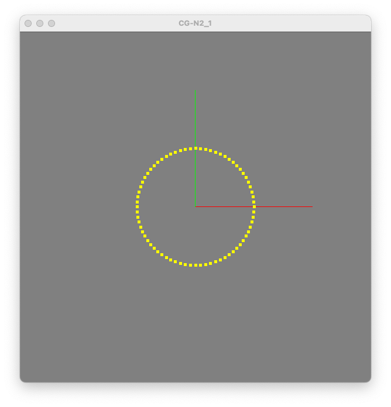

<!-- [@]TODO:INICIO atualizar -->

[CG_Biblioteca]:            ../../CG_Biblioteca/              "CG_Biblioteca"  
[CG_Biblioteca_Matematica]: ../../CG_Biblioteca/Matematica.cs "CG_Biblioteca_Matematica"  
[CG_Biblioteca_Ponto4D]:    ../../CG_Biblioteca/Ponto4D.cs    "CG_Biblioteca_Ponto4D"  

# Unidade 2: OpenGL (OpenTK) - atividade  

Lembretes:

- cada questão deste trabalho deve ser separada em novas pastas e projetos executados separadamente. Obrigatoriamente devem usar como base o projeto de exemplo (**CG_N2**) já disponível no GitHub da sua equipe. Lembrem que este projeto também usa o projeto [CG_Biblioteca] disponível na pasta raiz do GitHub da equipe.
- usem a pasta Unidade2 do GitHub da sua equipe para criar as novas pastas dos projetos e desenvolver/entregar o seu código.  

## 1. Explorar o uso da primitiva gráfica ponto no SRU  

Implemente uma aplicação para desenhar um círculo no centro do Sistema de Referência do Universo (SRU), com raio de valor 0.3. Utilize 72 pontos simetricamente distribuídos sobre o perímetro do círculo, de forma que o resultado final seja o mais parecido com a figura a baixo. Neste caso crie uma nova classe com o nome ```Circulo``` em ```Circulo.cs```.  

  

Observações:  

- desenhe somente os eixos positivos x e y, cada um com comprimento igual a 0.6;  
- utilize a Classe [CG_Biblioteca_Ponto4D] fornecida caso precise trabalhar com pontos no espaço gráfico;  
- experimente mudar a cor de fundo da tela e a cor de desenho dos pontos para ficarem igual a figura a cima;  
- utilize as funções sin(ang) e cos(ang) da Classe [CG_Biblioteca_Matematica] fornecida;  
- não é permitido usar o comando circle do OpenGL e nem outra implementação que não use as funções da classe [CG_Biblioteca_Matematica].  

## 2. Primitivas Geométricas  

Nesta aplicação a ideia é explorar a utilização das “primitivas geométricas” de forma que o resultado final seja o mais parecido com o vídeo a baixo.  

No caso a interação deve ser:  

- para alternar entre as “primitivas geométricas” use a tecla de “barra de espaço”;  
- as “primitivas geométricas” que devem ser utilizadas são: Points, Lines,  LineLoop,  LineStrip,  Triangles,  TriangleStrip e TriangleFan.  

  

## 3. Sr. Palito, dando seus primeiros passos  

Agora, crie uma nova aplicação com o objetivo de poder mover um Segmento de Reta (SR), aqui conhecido com Sr. "Palito", lateralmente usando as teclas Q (esquerda) e W (Direita). Ao iniciar a aplicação um dos pontos do Sr. Palito está na origem. O segundo ponto do Sr. Palito será definido com raio de valor 0.5 e ângulo 45º. Ainda é possível usar as teclas A (diminuir) e S (aumentar) para mudar  o tamanho (raio), e as teclas Z (diminuir) e X (aumentar) para girar (ângulo) do Sr. Palito. Olhe o exemplo no vídeo a baixo.  

Ah ... o Sr. Palito não se parece muito com o "desenho" do segmento de reta que representa um raio de uma circunferência !!  

  

## Atenção

A avaliação da atividade envolve o desenvolvimento das questões acima apresentadas, mas o mais importante é o integrante da equipe demonstrar conhecimento além do código desenvolvido, também os conceitos apresentados em aula relacionados com a atividade em si.

## Gabarito

  

----------

## ⏭ [Unidade 3)](../../Unidade3/README.md "Unidade 3")  
